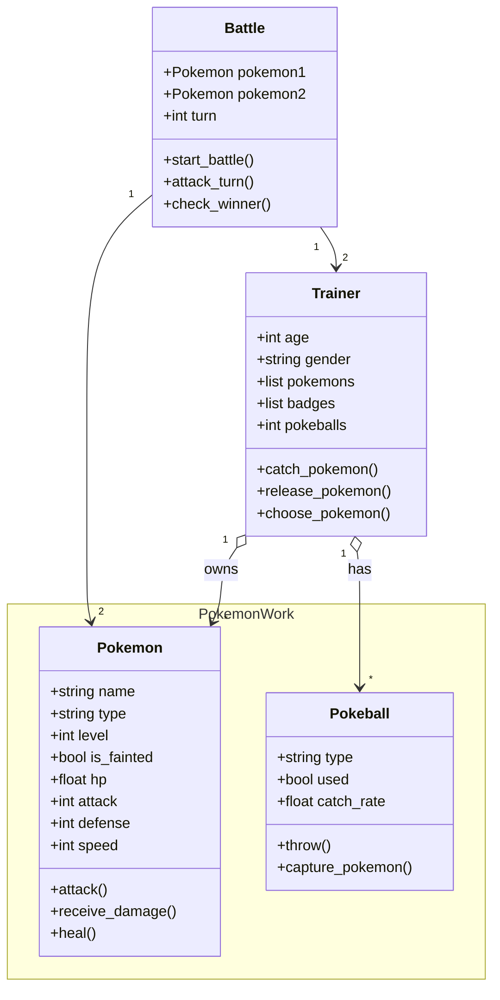
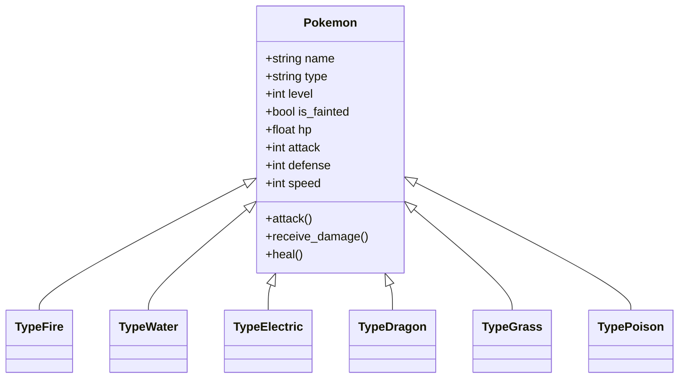

# Reto_2
## Ejercicio:

Desarrolle la mayoría de ejercicios en clase. Para cada punto cree un programa individual. Al finalizar suba todo a un repo y súbalo al canal reto_2 en slack.
1. Elija un problema de la vida real (sistema de gestión de biblioteca, negocio de compra-venta, automóvil, etc) que se pueda modelar a través de objetos y clases. Plantee las relaciones de clases, composiciones, propiedades y comportamientos del sistema en uno mas diagramas tipo UML.

## Solución

Problema Seleccionado: **Pokemon**

Planteamiento: Pokemon es un juego excesivamente complejo, en esta práctica buscamos abstraer lo esencial para el funcionamiento del juego, no se profundizara mucho en clases como items o incluso ciudades, vamos buscar las clases fundamentales:

* Pokemon: Son los *"Monstruos"* de la franquicia existen tipos de pokemons, tienen nivel, vida y stats fundamentales como lo pueden ser:
    * Velocidad
    * Fuerza
    * Resistencia
* Trainer: Un entrenador es como el *"Jugador"*
* Pokeball: Objeto esencial para cazar y obtener Pokemons en el juego, tienen rarezas y incluso estádisticas para atrapar.
* Battle: En esencia las batallas son interacciones entre dos entrenadores, en algunos juegos suele haber más de 2 entrenadores, en este caso para simplificar, una batalla solo va a tener dos pokemons simultaneos.
---
## Relación Jugador - Juego

## Qué es un Namespace
Namespace sirve para asignar zonas de trabajo separar areas en la arquitectura de un UML, usarla en este caso no es necesario pero en casos más complejos con diagramas mucho más elaborados sirve para entender y agrupar que clases trabajan en una misma área.
## Ejemplos de Herencia
Importante darnos cuenta que aunque nuestro diagrama UML es muy básico sería bueno resaltar lo que dijimos, existen los tipos de Pokemon, podemos utilizar la propiedad de la herencia en este caso con ejemplos como:
* Pokemon de Fuego **es un TIPO de** Pokemon
* Pokemon de Tierra **es un TIPO de** Pokemon
* Pokemon de Agua **es un TIPO de** Pokemon
* Pokemon de Aire **es un TIPO de** Pokemon

Note que son tipos de pokemon, aquí es donde entra los pokemon tipo fuego, tierra, agua, luz, etc
